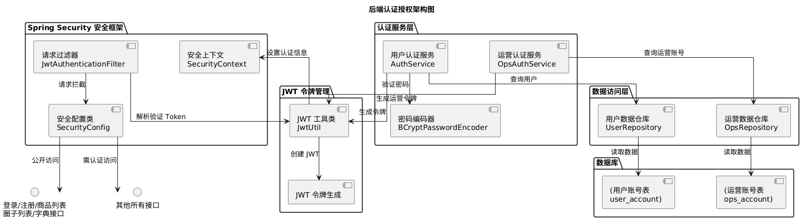
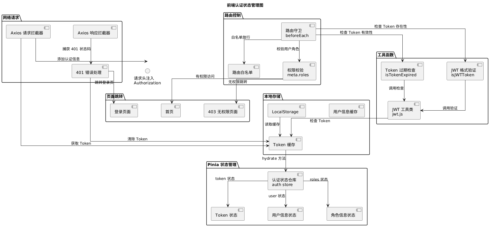
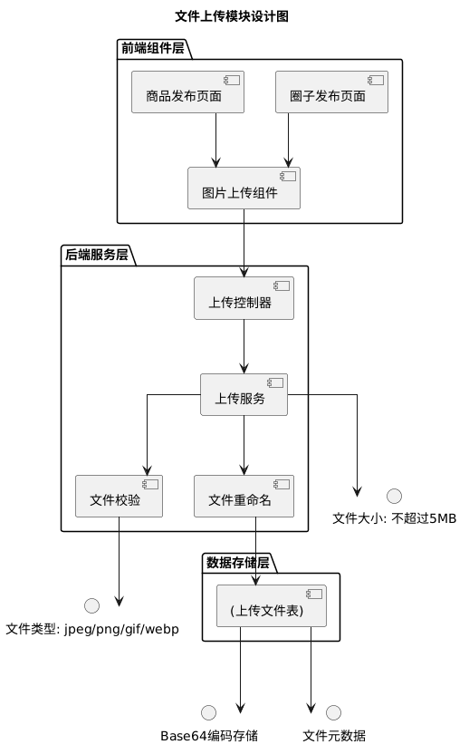
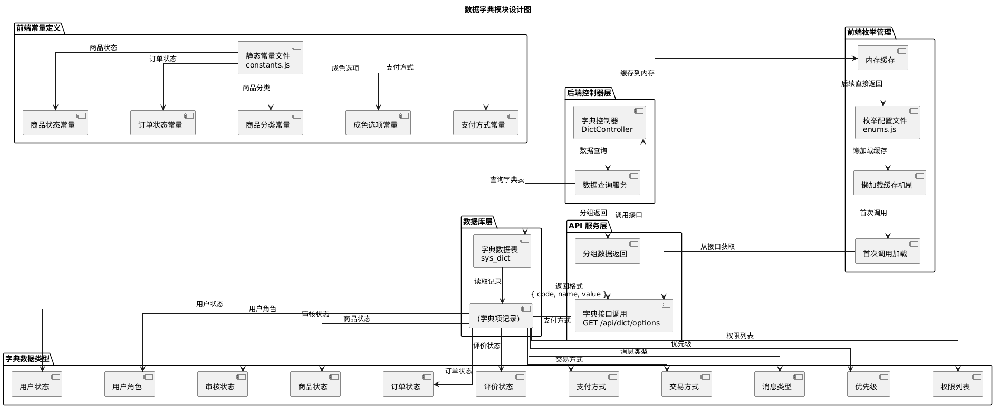
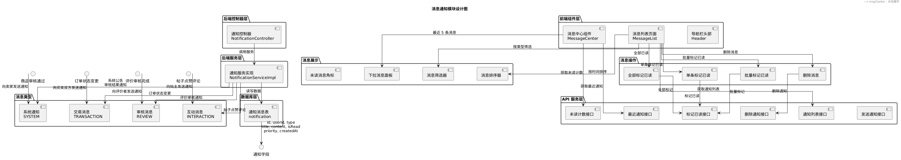

# 4 系统基础模块设计与实现

## 4.1 系统流程

校园二手交易平台整体业务流程围绕买家、卖家和运营三类角色展开。用户通过浏览器访问前端Vue 3应用，首次进入系统显示首页，包含商品轮播图、热门商品推荐和系统公告信息。用户可通过导航栏进入登录页面，支持普通用户注册登录和运营人员独立登录入口。登录成功后，系统通过JWT无状态认证机制验证用户身份，根据用户角色（BUYER/SELLER/OPS）动态分配页面访问权限。

系统核心数据流为：卖家发布商品→运营审核→商品上架→买家浏览/搜索→加入购物车/收藏→创建订单→支付→卖家发货→买家确认收货→提交评价→运营审核评价→评价展示。校园圈子数据流为：用户发布帖子→运营审核→帖子展示→其他用户点赞/评论。所有操作通过RESTful API与Spring Boot后端交互，数据持久化至MySQL数据库。

## 4.2 基础功能模块设计概述

根据需求分析，对基础功能模块进行如下设计：

**（1）认证授权设计**

系统提供用户注册、登录和角色管理功能，支持普通用户和运营人员双入口登录。用户注册时需填写用户名、密码、昵称、手机号和校区信息，密码经BCrypt加密后存储。登录时系统验证账号密码，验证通过后生成JWT令牌返回给前端，令牌包含用户ID、用户名和角色信息，有效期24小时。前端通过路由守卫校验用户角色权限，无权限访问时跳转403页面。运营人员通过独立接口登录，使用ops_account表独立于user_account表进行身份验证。

**（2）文件上传设计**

系统提供图片上传功能，主要用于商品发布时上传商品图片、校园圈子发布时上传帖子图片、评价提交时上传评价图片。文件类型限制为image/jpeg、image/png、image/gif、image/webp，文件大小限制为5MB。文件采用Base64编码存储策略，便于前端直接使用data URI展示，减少额外HTTP请求。上传文件信息存储到uploaded_file表，包含原始文件名、存储文件名、文件路径、文件大小、内容类型、Base64数据、上传者ID等字段。

**（3）数据字典设计**

系统提供枚举数据动态加载功能，包括用户状态、角色、审核状态、商品状态、订单状态、评价状态、成色选项、支付方式、交易方式、消息类型、优先级、权限列表等12类字典选项。字典数据从数据库字典表查询返回，前端通过字典接口获取筛选选项，实现配置化的状态管理。前端同时定义静态常量作为补充，包括商品状态、订单状态、商品分类、成色、支付方式、用户类型、交易方式等。

**（4）消息通知设计**

站内消息分为系统通知、交易消息、审核消息、互动消息四类，分别对应系统公告、订单状态变更、审核结果通知、点赞评论通知。每条通知包含id、userId、type、title、content、isRead、priority、createdAt字段。Header显示未读消息数量角标，点击展开最近消息面板。支持单条标记已读、批量标记已读、全部已读和删除操作。业务操作触发时自动生成通知，如商品审核通过后向卖家发送通知，订单状态变更时向买卖双方发送通知。

**（5）UI界面设计**

系统前端界面采用响应式布局设计，适配桌面端和移动端设备。定义完整的视觉规范系统，包括色彩系统（10级主色阶、4类功能色、6级灰阶）、字体规范（9级字号）、间距规范（8级间距）、圆角规范（5级）、阴影规范（4级）。运营后台采用独立主题，深蓝白色调设计系统，深色侧边栏背景，定义多个Mixin统一运营页面样式，4级响应式断点适配不同屏幕尺寸。

## 4.3 基础功能模块具体实现

### 4.3.1 认证授权设计与实现

后端采用Spring Security安全框架结合JJWT令牌库实现JWT无状态认证。安全配置类定义HTTP请求权限规则，公开登录、注册、商品列表、圈子列表、字典接口，其他接口需认证访问。JWT认证过滤器继承单次执行过滤器，从Authorization请求头提取Bearer令牌，使用JWT工具类解析验证，提取用户名、用户ID、角色信息，构建用户密码认证令牌设置到安全上下文。

认证服务处理用户登录验证，调用用户数据仓库查询用户信息，使用BCrypt密码编码器验证密码，验证通过后调用JWT工具类生成令牌。用户注册时，密码经BCrypt加密后存储到用户账号表。运营人员登录使用独立接口，调用运营认证服务验证运营账号表数据，生成运营专用令牌存储到独立的本地存储键。

前端认证状态仓库使用Pinia状态管理，定义令牌、用户、角色三个状态。初始化方法从本地存储读取缓存的令牌和用户信息，验证令牌方法检查令牌格式，检查过期方法调用JWT工具类检查过期时间。路由守卫拦截路由跳转，白名单直接放行，其他路由检查令牌存在性和有效性，根据路由元数据中的角色校验用户角色权限。Axios请求拦截器为每个请求注入认证头，响应拦截器捕获401状态码自动清除令牌并跳转登录页。

系统后端认证授权架构如图4.3所示，展示了Spring Security安全框架、认证服务层、数据访问层、JWT令牌管理模块之间的交互关系。

前端认证状态管理架构如图4.4所示，展示了Pinia状态管理、本地存储、工具函数、路由控制、网络请求之间的协作流程。

### 4.3.2 文件上传设计与实现

后端上传控制器提供文件上传接口，接收多部分表单数据格式的文件上传请求。上传方法通过当前用户服务获取当前登录用户ID作为上传者标识，调用上传服务处理文件存储逻辑。文件类型校验限制为JPEG、PNG、GIF、WEBP格式，文件大小限制为5MB。文件重命名采用UUID策略避免冲突，原始文件名、存储文件名、文件路径、文件大小、内容类型、Base64数据等信息存储到上传文件表。文件以Base64编码格式存储，便于前端直接使用数据URI展示。

前端图片上传组件提供双向绑定，自定义请求属性覆盖默认上传行为，调用商品服务发起文件上传请求。上传成功后返回文件地址，组件预览图片并支持删除操作。商品发布页面和圈子发布页面均集成图片上传组件实现图片上传功能。

文件上传模块架构如图4.5所示，展示了前端组件层、服务层、后端控制器层、存储层之间的数据流转关系。

### 4.3.3 数据字典设计与实现

后端字典控制器提供字典选项接口，从数据库字典表查询枚举数据返回给前端。字典数据包含代码、名称、值三个字段，支持分组返回。前端枚举文件定义懒加载缓存机制，首次调用时从接口获取数据并缓存到内存，后续调用直接返回缓存数据，减少网络请求。

系统定义12类字典选项：用户状态（激活、禁用）、用户角色（买家、卖家、运营）、审核状态（待审核、已通过、已拒绝）、商品状态（待审核、已上架、已拒绝、已下架）、订单状态（待付款、已付款、已发货、已完成、已取消、退款中、已退款）、评价状态（待审核、已通过、已拒绝）、成色选项（全新、几乎全新、轻微使用痕迹、明显使用痕迹）、支付方式（微信、支付宝、银行卡）、交易方式（面交、邮寄、自取）、消息类型（系统、交易、审核、互动）、优先级（低、中、高、紧急）、权限列表（查看商品、管理商品、管理订单等）。前端常量文件定义静态常量作为补充。

数据字典模块架构如图4.6所示，展示了前端常量定义、枚举管理、服务层、控制器层、数据库层之间的数据流转。

### 4.3.4 消息通知设计与实现

后端通知控制器提供通知列表、未读计数、最近通知、标记已读、批量标记已读、全部标记已读、删除通知、发送通知等接口。通知服务实现类实现业务逻辑，支持四种消息类型：系统通知（如审核结果通知）、交易消息（如订单状态变更）、审核消息（如评价审核通知）、互动消息（如帖子点赞评论）。每条通知包含编号、用户ID、类型、标题、内容、是否已读、优先级、创建时间字段。

前端消息中心组件集成到导航栏头部，点击展开下拉面板显示最近5条未读消息，导航栏头部显示未读数量角标。消息列表页面展示完整消息列表，支持按类型筛选、按时间排序、单条标记已读、批量标记已读、全部已读和删除操作。业务操作触发时自动生成通知，如商品审核通过后向卖家发送通知，订单状态变更时向买卖双方发送通知。

消息通知模块架构如图4.7所示，展示了前端组件层、消息展示、消息操作、服务层、控制器层、数据库层之间的交互关系。

## 4.4 基础UI界面设计与实现

### 4.4.1 UI界面设计

**（1）登录界面**

登录页面提供用户名和密码输入框、记住密码选项、登录按钮和注册入口链接。页面布局简洁，居中对齐，背景色为浅灰色。输入框带图标提示，密码输入框支持显示/隐藏切换。登录按钮采用主色调#165DFF，hover时颜色加深。

**（2）注册界面**

注册页面包含用户名、密码、确认密码、昵称、手机号、校区选择等表单字段，支持表单实时验证。用户名要求6-20位字母数字组合，密码要求至少8位且包含大小写字母和数字。校区选择使用下拉菜单，列出所有支持的大学校区。注册按钮在表单验证通过后启用。

**（3）首页界面**

用户首次进入系统时显示首页，包含顶部导航栏、商品轮播图、热门商品推荐区和系统公告区。导航栏包含Logo、主菜单（首页/商品/圈子/AI助手）、搜索框、购物车图标、消息图标和用户头像下拉菜单。轮播图展示平台活动或精选商品，热门商品区以瀑布流布局展示热度评分最高的商品。

**（4）个人中心界面**

个人中心页面展示用户头像、昵称、角色标签和基本资料，支持编辑个人资料、修改密码、查看我的订单、我的收藏和我的评价等快捷入口。页面采用卡片式布局，左侧为用户信息卡片，右侧为功能入口网格。

**（5）运营后台界面**

运营后台采用深色侧边栏导航，主内容区采用卡片式布局。数据仪表盘页面展示统计卡片（今日订单数、今日完成数、今日金额、总金额）和趋势图表（订单趋势折线图、商品分类统计饼图、订单状态分布柱状图）。审批工作台页面整合商品、评价、帖子三类待审核内容的统一列表，支持批量审核操作。

### 4.4.2 UI界面实现

前端基于Vue 3组合式API和脚本设置语法构建组件。头部导航栏组件使用弧形设计的菜单、角标、下拉菜单组件实现导航栏，通过认证状态仓库获取当前用户信息，路由守卫控制菜单显示。登录视图组件使用表单、输入框、按钮组件构建登录表单，调用认证服务发起登录请求，成功后存储令牌到本地存储并跳转首页。

注册视图组件使用表单组件构建注册表单，包含输入框、选择器、按钮等子组件，表单验证规则定义在验证规则对象中，提交时调用认证服务发起注册请求。个人资料页面展示用户基本信息，使用头像组件显示头像，描述列表组件展示用户资料，标签页组件切换不同功能区域。

运营后台布局组件采用布局组件，侧边栏使用菜单组件定义菜单项，主内容区使用布局内容组件。数据仪表盘页面使用柱状图、环形图、折线图组件展示统计图表，底层基于可视化图表库封装实例。所有运营页面使用卡片、页面容器、工具栏等样式混合统一样式风格，确保界面一致性。
